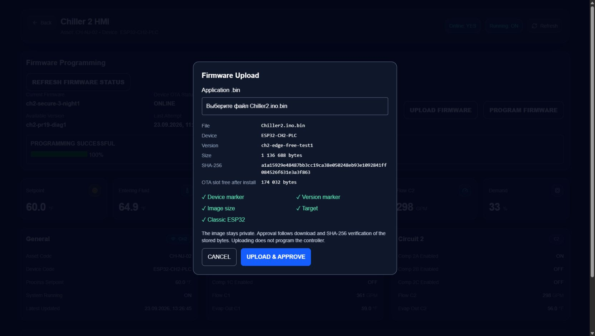
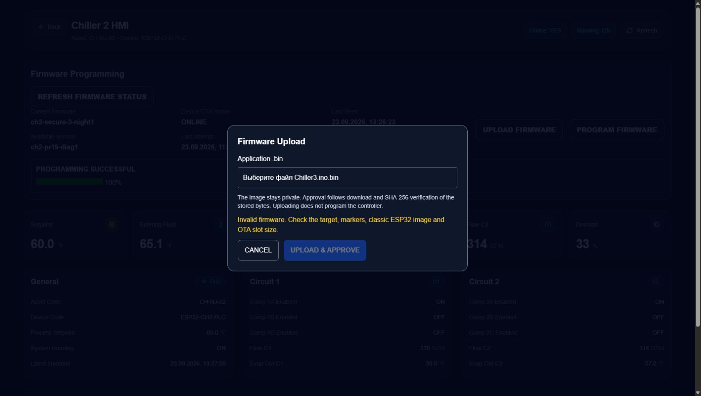
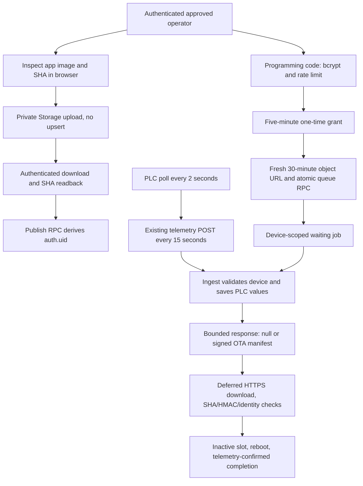

# CH2/CH3 telemetry-piggyback OTA

The SQL migration, private PR20 provisioning and frontend are now live in production.
The latest rollout record below supersedes earlier blocked-attempt records retained
for audit. No Edge deletion/deployment, release publication, OTA queue, controller
command, flash, or merge accompanied this task. CH1 is unchanged.
This replaces PR19's embedded WSS worker; it does not establish the cause of the
earlier CH2 reboot loop or claim that the replacement passed physical testing.

## Latest production rollout — 2026-09-23

**PRODUCTION HOSTED BACKEND/UI VALIDATION: PASS.**

The current production website session was verified through Supabase Auth's getUser
endpoint without exporting its bearer token. Only that exact owner's UUID was
allowlisted. One config row contains a locally generated **bcrypt `$2a$`, cost 12**
hash of the new independent PR20 code and Storage origin
`https://eeobivvwjzakbweluwtm.supabase.co`. Exactly two device-key rows contain the
unchanged working CH2/CH3 OTA HMAC keys. Counts and equality checks passed.
The frontend/Vercel origin is deliberately not the Storage origin.

Provisioning used bind parameters over a TLS-verified PostgreSQL session pooler,
with the official Supabase CA. Direct database DNS is IPv6-only on this network.
The effective backend session settings were explicitly verified: `log_statement=none`,
parameter lengths for normal/error logs `0`, duration logging disabled,
`pgaudit.log=none`, `pgaudit.log_parameter=off`, and auto-explain disabled. No secret
SQL was submitted through Dashboard history. No global logging settings changed.

Hosted unlock found a concrete compatibility issue: bcryptjs's default `$2b$`
output passes its own verifier but this pgcrypto runtime does not verify it.
A local reproduction confirmed `$2a$` interoperability. The same new code was
rehash-provisioned locally using a `$2a$` salt, cost 12; no programming code or
legacy secret was changed. One rejected attempt preceded the fix, then one correct
hosted unlock passed. The resulting five-minute grant was left unused; the database
was verified to store its SHA-256 hash rather than plaintext. No job was queued.

| Hosted check | Result |
|---|---|
| Authenticated current owner / operator predicate | PASS / true |
| Operators / config / HMAC counts | PASS: 1 / 1 / 2 |
| New PR20 code bcrypt / correct-code unlock | PASS |
| Authenticated private upload, `upsert:false` | PASS: HTTP 200 |
| Authenticated stored-byte readback / exact SHA | PASS |
| Anonymous normal private-object access | PASS: denied, HTTP 400 |
| Signed URL | PASS: exact object, 1,800-second token lifetime |
| Anonymous signed download / exact size and SHA | PASS: HTTP 200 |
| UPDATE and upsert | PASS: RLS denial, HTTP 400 / Storage 403 |
| DELETE | PASS: HTTP 200 with zero deleted rows; object still present and unchanged |
| Test-only release approved / OTA job queued | NO / NO |
| Production CH2 and CH3 programming pages | PASS: UPLOAD FIRMWARE and PROGRAM FIRMWARE present |
| Valid CH2 metadata / wrong-target CH3 rejection | PASS / PASS |

The intentionally retained immutable, **unapproved** test object is
`chiller-firmware/ESP32-CH2-PLC/ch2-edge-free-test1/a1a15929e48487bb3cc19ca38e050248eb93e1092841ff084526f631e3a3f863.bin`:
1,136,688 bytes, SHA-256
`a1a15929e48487bb3cc19ca38e050248eb93e1092841ff084526f631e3a3f863`.
There is no release row for this test version, so it is excluded from programming
selection. No DELETE policy was weakened to clean up the object. Backend Storage
tests ran in the authenticated production browser session; UI inspection then used
the real deployed modal. `UPLOAD & APPROVE` and final programming were not pressed.
The temporary browser file picker used for the API test was removed.

Vercel production deployment:
`BmibhV15yxuLoWgVwzKgViCoY4XE`, source `0dddb78`, promoted to
`https://farmplast.vercel.app` at approximately **17:25:36 UTC / 13:25:36 New York**.
Vercel rebuilt using production environment settings. Previous production deployment
`BQAyLUJZUDRwptZPRn9r38ehNRoP` remains the frontend rollback reference. PR20 is unmerged.

Visible-browser idle capture **17:27:54–17:30:53 UTC**, without truncation, recorded
**0** `chiller-ota` calls, **0** WebSocket connections, and **0** firmware-status RPC
reads. Ordinary telemetry UI reads continued. This establishes no five-second idle
OTA status polling in that window. An earlier navigation capture was truncated and
is not used as lossless evidence. Legacy physical firmware still calls Edge; total
production Edge traffic is not zero.

Hosted empty-readings probes (no PLC writes, receipts, registration or boot changes)
returned legacy-compatible HTTP 200 and protocol-2 HTTP 200. Measured decoded bodies:
legacy **70 bytes** (`content-encoding: br`, chunked, no Content-Length); no-job v2
**11 bytes**, logical `{"o":null}`, Content-Length **11**, no content encoding.
These are serialization checks, not a simulated physical telemetry cycle or a job
manifest test. The v2 size confirms **63,360 response-body bytes/device/day** at
5,760 telemetry posts, **126,720 bytes/day for two** continuously awake devices.
Headers/TLS billing and active manifest/terminal sizes remain unmeasured; no billing
claim is derived from the legacy decompressed response size.

Added regressions cover frontend-origin rejection, a different Supabase project's
signed URL rejection, and pgcrypto-compatible bcrypt format. **10/10 targeted
database tests PASS.** No unapproved authenticated session was available for an
additional real-account negative test; existing SQL/RLS regressions cover that role.

Evidence lives in `C:/Users/Owner/Documents/farmplast/pr20-production-rollout/`:
`provisioning-result.json`, `bcrypt-format-correction.json`, `provisioning-verified.json`,
`hosted-storage-result.json`, `storage-immutability-result.json`,
`response-shape-probe.json`, `production-ui-idle-network.json`, `post-ui-samples.json`.
None contains the code, HMAC keys, signed URLs, session token or owner UUID.

Connection/logging references: [Supabase PostgreSQL connections](https://supabase.com/docs/guides/database/connecting-to-postgres)
and [PostgreSQL logging controls](https://www.postgresql.org/docs/15/runtime-config-logging.html).

Post-deployment observation: **17:26:13–17:36:17 UTC / 13:26:13–13:36:17 New York**,
**604.482 seconds, 41 samples**. Both controllers retained their original boot IDs
and night firmware versions. All 15 active PLC point timestamps advanced on each
controller, and multiple raw values/statuses changed. Maximum sampled telemetry
age was **17.142s CH2 / 13.135s CH3**; maximum legacy sync age was **9.556s / 6.914s**.
Active jobs stayed **0**, total jobs stayed **15**, failed-job count did not increase,
and events stayed **173** throughout this window. Fresh visible legacy Edge
invocations were all HTTP 200. The unused grant was verified expired naturally.
See `post-ui-summary.json`; these are 15-second samples, not a lossless packet log.

| Final result | Status |
|---|---|
| PR20 operator provisioned | YES |
| New PR20 programming code hash provisioned | YES |
| Supabase Storage origin provisioned | YES |
| CH2 / CH3 HMAC provisioned, unchanged | YES / YES |
| Hosted unlock/grant | PASS |
| Storage upload/readback / SHA / private access / signed URL | PASS |
| PR20 production UI deployed | YES |
| CH2 / CH3 healthy after rollout | YES / YES |
| PR20 new-flow Edge calls / WebSockets in verified idle window | 0 / 0 |
| READY TO BUILD REAL EDGE-FREE CH2 IMAGE | YES |

This readiness authorizes no flash or OTA job. Physical Edge-free firmware,
manifest delivery during an actual job, and installation remain untested in this
rollout. Legacy Edge remains deployed with all its existing secrets unchanged.
PR20 remains draft/unmerged. No physical firmware changed.

## Baseline inspected

- Base: PR19 `2f37d5cab1855ae3b11a04033190d751384e9cb2`, draft/unmerged.
- Separate branch: `codex/ch23-edge-free-ota`.
- Production read-only snapshot: 2026-09-23 15:29:31.716074 UTC,
  project `eeobivvwjzakbweluwtm`.
- CH2 reported `ch2-secure-3-night1`, telemetry 15:29:30.409946 UTC.
  CH3 reported `ch3-secure-3-night1`, telemetry 15:29:26.614527 UTC.
  Zero nonterminal jobs; private firmware bucket; PR19 wake RPC present.
  The return of CH2 to its old firmware was observed, not performed by this task.
- Installed ingestion function MD5: CH2 `c1a1ea7cc88b58620d258508a60088e9`,
  CH3 `a1f9386594747d758da0a72da0d8cbe1`. The migration preserves the exact installed
  definitions by moving them into a private schema, rather than overwriting the
  production point mapping with a historical copy.
- Edge inventory still showed `chiller-ota`, eight deployments, and the separate
  `ch1-ota`, four deployments. Neither function was changed.

## Architecture

Normal discovery requires no extra connection or request. `ChillerOtaRealtime.h`,
`OtaWakeSchedule.h`, the FreeRTOS wake worker, heartbeat, debounce, reconnect and
hourly Edge fallback are removed from the new firmware. WebSockets is not a build
dependency. PLC stays at 2 seconds, telemetry at 15 seconds.

Gateway metadata includes protocol `2`, version, boot ID, job ID, phase, progress,
allowlisted failure code and reset reason. No-job responses contain only `o:null`.
An outstanding terminal acknowledgement adds `a:completed` or `a:failed` so the
device can persist it. Manifests contain only one device's job, action, device,
model, version, hash, size, expiry, bounded URL and MAC. They contain no history or
release list. The response sink caps decoded bodies at 4096 bytes and handles both
Content-Length and HTTP chunked transfer encoding.

HTTP/TLS/JSON objects from ingestion are destroyed before installation starts.
Existing NVS one-record persistence, consumed-job protection, inactive-slot writes,
SHA-256, embedded markers, CA validation, ten-minute installation deadline and
rollback-enabled bootloader requirement remain. The v2 MAC adds the exact URL to
the existing canonical manifest fields. Old Edge signatures are unchanged for old
firmware; v2 devices accept only the new URL-bound signature.

During download the ordinary telemetry loop is suspended as before. Required
transition acknowledgements and at most one progress report per 15 seconds use
`chiller_ota_report`, an authenticated Postgres RPC, with short-lived HTTPS. This
is an **active-update-only** exception to piggyback reporting. Reports cannot write
PLC telemetry receipts, cannot discover jobs, and cannot fake post-reboot telemetry.
There is no idle report caller or additional idle timer. After reboot, only actual
authenticated PLC ingestion with the target version and a different boot completes
the job. Reset reason is remotely visible through the status RPC; heap counters
remain optional, default-off, once-per-minute UART diagnostics.

## Upload and approval

`UPLOAD FIRMWARE` opens a modal. The operator selects an application `.bin`; the
browser derives device/version from unique NUL-terminated embedded markers, checks
the classic ESP32 header and application descriptor, verifies selected target and
slot size, computes SHA-256, and displays remaining slot bytes. This is header and
marker inspection, not a substitute for ESP-IDF's complete image verification.
No manually entered device/version is accepted.

The authenticated operator uploads with `upsert:false` to
`chiller-firmware/ESP32-CHx-PLC/<version>/<sha256>.bin`. It then downloads those bytes
through the authenticated Storage session and compares size and SHA. Only after
that succeeds does `chiller_firmware_publish` approve the release. A conflicting
device/version fails; an identical approved release is idempotent. A revoked release
requires administrative review. Failed or interrupted upload may leave an immutable
unapproved object; retry reads it back rather than overwriting it.

**Trust boundary:** SQL can verify Storage object identity/size, but cannot hash the
external object bytes. The approved operator's browser performs the required
readback and submits a matching verification attestation, recorded privately with
operator, object ID and time. This is not an independent server-side SHA guarantee
against a malicious approved operator. Unapproved users cannot invoke publication;
authenticated users cannot approve by raw table insert. Devices independently verify
the hash and signed manifest before activation. No permanent signed URL is created
at publication. The old service-role `--publish` CLI path is retired.

## Programming and database security

1. `chiller_firmware_unlock(device, code)` derives `auth.uid()` and checks the private
   operator allowlist, then the existing limit of five attempts per 15 minutes.
   Failed attempts return an error object instead of raising, so the counter commits.
2. The existing four-digit code is verified against a private bcrypt hash (cost
   12–16), never a frontend constant or a publicly readable table. A 32-byte random
   grant lasts five minutes; only its SHA-256 is stored.
3. The browser creates a fresh Storage signed URL for the selected release, requesting
   1800 seconds. It reads the token's actual expiry rather than trusting its clock.
4. The authenticated six-argument `chiller_ota_queue` overload derives the operator,
   validates exact configured HTTPS origin, bucket/object path and JWT URL claim,
   and requires 11–31 minutes remaining (30 minutes requested; one-minute clock
   tolerance). Storage verifies the JWT signature when the device downloads. SQL
   does not claim to verify Storage's signature. A fabricated token cannot bypass
   Storage download authentication or the image hash.
5. The queue atomically consumes the grant and creates one idempotent request ID,
   requires fresh actual telemetry and an approved release, and preserves the unique
   active-job constraint. Repeating the same operator/device/release/request ID
   returns the same job without another grant consumption or any wake.
6. The waiting-job budget is 20 minutes, capped at one minute before URL expiry.
   First authenticated discovery reduces it to the existing ten-minute install
   budget. Expiry is checked on status, telemetry or report; terminal jobs are not
   reissued. No wake is broadcast.

`chiller_firmware_status` returns device state, approved releases, ten recent jobs
and the last successful update, with no download URLs, device keys, code hash or
grant. UI performs an initial read and manual refresh; 5-second polling runs only
for active jobs and stops on terminal status or while hidden.

The migration is `supabase/ch23_edge_free_ota.sql`. All new SECURITY DEFINER entry
points lock `search_path`. `ch23_ota_private` is not an exposed API schema. It stores
the allowlist, bcrypt configuration, original OTA HMAC device keys, per-job URLs,
readback attestations, and preserved ingest implementations. No public role can
read or mutate those tables. Helper functions are revoked from public API roles.
The public report RPC validates the existing active device ingestion credential.
Ingest validates credentials outside its OTA error handler; malformed OTA metadata
cannot roll back otherwise valid PLC ingestion.

## Storage policies

The bucket remains private with a 1,310,720-byte limit. Approved authenticated
operators get INSERT and SELECT only. Paths must match the CH2/CH3 device/version/
SHA pattern. Restrictive policies deny anonymous firmware access and prevent
UPDATE/DELETE even if unrelated permissive policies exist. Non-firmware buckets
retain their existing behavior. Devices have no bucket-list permission. Signed
downloads authorize only their one object. SELECT inherently lets trusted operators
request signed URLs themselves; the application and queue enforce the bounded
programming lifetime, rather than claiming RLS can constrain Storage's `expiresIn`.

## Migration order and compatibility

The production execution records below identify completed steps. The owner's latest
authorization uses independent PR20 operator/code credentials and preserves legacy
Edge secrets; it does not authorize flashing or queueing firmware in this task.

1. Resolve/record the installed hardware baseline separately. Confirm no active jobs
   and fresh PLC telemetry. Preserve old firmware, private configs, Edge source and
   exact ingestion definitions. Keep PR19's deployed Edge and secrets unchanged.
2. Test the migration with real Supabase Storage/Auth in an isolated staging project.
   Local SQL tests do not exercise the hosted Storage HTTP/JWT implementation.
   Verify authenticated upload, readback, signing, private-object denial, bounded
   URLs and legacy firmware compatibility there before any production deployment.
3. Apply the SQL transaction once, after existing compact telemetry, base OTA,
   observability, failure diagnostics and PR19 wake migrations. Reapplication aborts
   safely rather than wrapping ingestion twice. No releases/jobs/events are deleted.
4. Privately provision `ch23_ota_private.operators` with only the current owner's
   UUID verified by the authenticated production session's Auth getUser endpoint.
   Use a new independently supplied PR20 four-digit programming code, hashed
   locally with bcrypt cost 12–16. The code need not match the unknown legacy Edge
   code. Set `config.origin` to **`https://eeobivvwjzakbweluwtm.supabase.co`**:
   this is the project/Storage origin used to validate signed download URLs, never
   the frontend/Vercel origin. Populate device_keys with the **existing exact** CH2/CH3
   HMAC keys. Use a privileged parameterized database connection/secret runner,
   with statement/parameter logging disabled. Do not place the clear code, keys or
   signed URLs in SQL Editor history, repository, shell arguments or reports. Do not
   change Edge secrets. Provisioning is intentionally absent from the public SQL;
   unprovisioned unlock/queue fails closed. Before rollout, the operator must supply
   this private provisioning through the approved secret workflow.
5. Verify row counts and ACLs, no telemetry regression, private bucket, and legacy
   telemetry/sync. Legacy `chiller_device_sync`, queue overload and Edge remain.
   Protocol-absent telemetry returns its original response. Old physical firmware
   still uses its existing Edge path, including for the first migration OTA.
6. Deploy the new UI only after schema/provisioning verification. Build real device
   images from private configs with unique versions and validate partitions/hash.
   The local compile-only artifacts below contain example credentials and MUST NOT
   be published or installed.
7. Later, under explicit authorization, migrate one physical controller, perform
   normal-operation and outage/OTA/rollback tests, then the other. New devices need
   the new UI's queue (which stores the bounded URL); an old Edge-only queue does
   not provision a v2 download. Do not silently fall back to Edge on v2 devices.
8. Delete legacy Edge and wake-only DB objects only in a later explicitly approved
   cleanup after both devices are stable and no rollback compatibility is needed.

## Rollback

Before physical migration, reverting the UI leaves old firmware/Edge fully usable;
leave the additive database migration in place. If new firmware needs reverting,
use the new authenticated programming flow to deliver the exact preserved known-good
device image while it remains reachable, or the already-established local recovery
path. Do not claim OTA recovery works when the device cannot connect. Never create
repeated jobs while a job is nonterminal.

Keep the v2 ingest wrappers and queue until no v2 firmware remains. Rolling back
the wrappers first would remove v2 discovery and acknowledgements. Only after that
condition is verified, a reviewed transaction may remove the public wrappers and
move the preserved private `ingest_ch2(jsonb)`/`ingest_ch3(jsonb)` functions back to
`public`, restoring their captured original grants. Do not drop the private schema,
release/job history or Storage objects as a routine rollback.

## Traffic and egress

Per continuously awake device: 86,400 / 15 = **5,760 existing telemetry POSTs/day**;
two devices = **11,520/day**. The 07:00–22:00 schedule, if retained by a deployed
firmware variant, scales these values to 3,600 and 7,200. This PR does not introduce
or change a sleep schedule.

- New firmware OTA Edge invocations: **0** (including active OTA).
- Additional idle OTA-only requests: **0**.
- Permanent embedded Realtime connections: **0**.
- Compact no-job JSON is 10 bytes minified / 11 bytes in PostgreSQL JSONB text.
  Budgeting 11 bytes gives **63,360 bytes/device/day**, **126,720 bytes/day for two**
  (about 0.121 MiB), excluding HTTP headers/TLS. A persisted completed ACK is
  26 bytes minified / 29 JSONB-text bytes: at most 167,040 bytes/device/day.
- The previous function result was `ok`, asset_code and device_code (70 JSONB-text
  bytes). This implementation replaces that result, so payload bytes can decrease
  even though firmware now consumes the response. `Prefer:return=minimal` is not
  treated as proof that hosted RPC responses were zero bytes; validate real staging
  wire bytes and billing separately.
- Old 15-second Edge sync adds another 5,760 calls/device/day, plus its response,
  headers and TLS overhead. These are eliminated for migrated devices.
- PR19's intended WSS model had hourly Edge fallback plus persistent join/heartbeat/
  reconnect traffic. The failed physical window observed at least 127 successful
  syncs in 30m10s amid boot churn. No lossless WSS byte capture exists, so a numeric
  WSS-egress saving is **not measured**. The new design eliminates that connection.
- Firmware upload/readback costs one image upload and one image-size authenticated
  download per verification. A real OTA downloads the image once. These are
  occasional operations, not idle traffic. UI status responses are separate and
  idle polling is absent.

## Validation evidence

Final results: **85/85 tests pass**, Vite production build passes, changed UI files
pass ESLint. The final image/partition validator passes for both devices with the
required 64 KiB minimum margin. These are default-off diagnostic-mode builds with
example credentials and unique compile-test versions, not physical-test releases.

| Resource (bytes) | CH2 | CH3 |
|---|---:|---:|
| Preserved PR19 WSS image, diagnostics off | 1,228,256 | 1,228,240 |
| Final telemetry-piggyback app `.bin` | 1,136,688 | 1,136,688 |
| Flash recovered | 91,568 | 91,552 |
| Remaining 1,310,720-byte OTA slot | 174,032 | 174,032 |
| Static RAM before / after | 49,456 / 49,344 | 49,456 / 49,344 |

The earlier real `ch2-pr19-diag1` image was 1,230,192 bytes with diagnostics enabled;
it is a separate reference, not a like-for-like configuration comparison. Unique
version/configuration strings also affect exact binary size. Dynamic WSS/TLS/worker
heap savings remain unmeasured; a 112-byte static-RAM reduction is not a runtime
heap measurement. The board's generic 8 MB compiler maximum is not the OTA slot:
the post-link validator checks the actual default partition binary and 64 KiB margin.

See `ch23-edge-free-build-results.json` for final compile-only image/hash/partition,
flash/headroom and static-RAM comparison. Hardware runtime remains **NOT TESTED**.
Automated tests execute the SQL migration with pgcrypto, storage RLS and simulated
Auth roles, plus real frontend byte validation and the existing firmware security,
deferred-execution, failure and rollback regressions. Legacy Edge tests remain for
migration compatibility; tests specific to the deleted WSS worker are superseded.
The local visual fixture uses an in-memory Storage/RPC adapter and cannot create a
production object or job.

Desktop browser verification: the compiled CH2 app's embedded identity/version,
size/hash and headroom appeared correctly; local readback/approval completed; the
compiled CH3 app was rejected in the CH2 modal with approval disabled.

## Hosted staging validation — 2026-09-23

**HOSTED STAGING VALIDATION: FAIL — BLOCKED before execution.** This is an
environment prerequisite failure, not an observed failure of the implementation.
Branch `codex/ch23-edge-free-ota`, HEAD
`0dddb788b9fa359c989b19fb842aae235887bf2b`; working tree was clean at intake.

The authenticated Supabase dashboard exposes only the SimScope free organization.
Its New Project page reports that organization members have reached the limit of
two active free projects, and disables project creation. Existing projects are
production Farmplast and unrelated Hvac; neither is an isolated staging target.
Neither was changed or repurposed. No staging project was created, no migration
was applied, and no credentials, releases or jobs were provisioned in this task.
An isolated hosted project or available project capacity is required to resume.

| Required hosted check | Result |
|---|---|
| Migration, private schema and locked SECURITY DEFINER search paths | NOT RUN |
| Auth and unprovisioned fail-closed behavior | NOT RUN |
| Storage upload/readback and stored SHA verification | NOT RUN |
| Private bucket, operator RLS and immutable object negative tests | NOT RUN |
| Programming code, rate limit, grant consumption and idempotent queue | NOT RUN |
| Signed URL lifetime, isolated access and download SHA | NOT RUN |
| No-job telemetry response and job manifest via telemetry | NOT RUN |
| CH2/CH3 isolation and completion via new-boot telemetry | NOT RUN |
| Actual hosted browser flow and screenshots | NOT RUN |
| No-job / manifest / terminal HTTP body bytes and headers | NOT MEASURED |
| Edge calls and Realtime connections during the hosted flow | NOT MEASURED — flow did not run |

The egress figures above remain estimates, not hosted HTTP measurements. No hosted
zero-call or zero-WebSocket result is claimed from an unexecuted flow.

Independent offline recheck: both existing compile-test images remain 1,136,688
bytes and match the SHA-256 values in `ch23-edge-free-build-results.json`.
Literal scans of both images, both runtime `.ino` sources and `firmware/common`
found none of `/functions/v1/chiller-ota`, `WebSocketsClient`, or
`realtime/v1/websocket`. This supports static dependency removal only; it does not
replace hosted traffic capture.

**READY FOR PRODUCTION SCHEMA/UI ROLLOUT: NO.** All hosted gates remain pending.
Production, legacy Edge Functions, physical controllers and PR merge state were
left unchanged. Resume the complete hosted test sequence once an isolated staging
project is available; the earlier local fixture results are not hosted evidence.

## Earlier incomplete production attempt — 2026-09-23 16:24 UTC

**PRODUCTION HOSTED BACKEND/UI VALIDATION: FAIL — rollout incomplete.**

Production project: `eeobivvwjzakbweluwtm`. Exact source commit:
`0dddb788b9fa359c989b19fb842aae235887bf2b`. The complete migration file was
submitted unchanged and committed successfully. Verification at 16:24:45 UTC
confirmed that the two public wrappers and private preserved ingest functions
exist. Original function bodies match exactly after accounting only for the schema
move. All 7 release IDs, 15 job IDs and 171 event IDs remain present and unchanged.
Telemetry table columns are unchanged. Private schema access is denied to anon
and authenticated; new SECURITY DEFINER functions have locked empty search_path.
The two moved original functions retain their exact captured definitions/settings.

Exact rollback definitions, ACLs, Storage policies/bucket settings, history IDs and
device observations are preserved outside the repository at
`C:/Users/Owner/Documents/farmplast/pr20-production-rollout/`.
`before/restore-public-ingest.sql` is prepared but has not been executed.

| Gate | Result |
|---|---|
| SQL migration and preservation checks | PASS |
| Private provisioning | BLOCKED: existing code and exact operator allowlist unavailable locally |
| Old CH2 / CH3 compatibility | PASS for observed 10m41s window; sampled evidence below |
| Anonymous management rejection | PASS: HTTP 401, SQLSTATE 42501 |
| Private schema not exposed through PostgREST | PASS: HTTP 406, PGRST106 |
| Anonymous operator predicate | PASS: HTTP 200, `false` |
| Anonymous Storage upload rejection | PASS: HTTP 400, Storage status 403 |
| Approved operator upload / authenticated readback / SHA readback | NOT RUN |
| Normal private-object read denial / non-operator / UPDATE / DELETE | NOT RUN |
| Signed URL and programming-code/grant checks | NOT RUN |
| Production Upload Firmware UI / wrong-target rejection | NOT RUN; frontend not promoted |
| Actual no-job hosted response bytes | NOT MEASURED |

The existing local `CH3_INGEST_DEVICE_SECRET` was rejected by production
(`P0001`, invalid device credentials) during an empty-readings probe. This probe
did not write PLC data, telemetry receipts, device registration or boot metadata.
The protocol-2 probe was not sent after the legacy probe failed. The error response
was 112 bytes; it is **not** a no-job response measurement. Do not substitute the
local secret or modify the physical device. Natural physical CH3 ingestion still
succeeds, so this is a diagnostic-credential blocker, not observed controller failure.

Compatibility observation: **16:24:45–16:35:26 UTC (12:24:45–12:35:26 New York),
10m41s**. Eight PLC/device snapshots plus the immediate post-commit verification
showed fresh receipts and legacy sync, unchanged versions and boot IDs, changing
PLC values, zero active jobs, 171 unchanged events and no increase in failed jobs.
Maximum sampled telemetry age: CH2 **14.046s**, CH3 **14.733s**; maximum sampled
legacy sync age: CH2 **11.773s**, CH3 **14.988s**. These are periodic samples, not
a lossless record of every 15-second request. The 15 active raw/boolean PLC points
advanced; six historical derived rows per device retained their preexisting
September 11 / August 17 timestamps and are not claimed as fresh measurements.

| Controller | Current version | Stable boot ID |
|---|---|---|
| CH2 | `ch2-secure-3-night1` | `e2319837abf270d627c437cb1f8cbfe4` |
| CH3 | `ch3-secure-3-night1` | `05d8ec66600e4deb52b9a61d277cf261` |

CH2 healthy after SQL rollout: **YES**. CH3 healthy after SQL rollout: **YES**.
PLC active values updating: **YES**. Legacy OTA Edge path healthy: **YES** in
observed sync state/invocations. Active OTA jobs: **0**. The requested additional
15-minute post-frontend window has not started because frontend deployment is gated.

Existing HMAC key fields are locally available, but their values have not been
rotated or reprovisioned. The existing programming code and exact approved operator
allowlist were requested via an ignored private file; no replacements were created.
All new management RPCs remain fail-closed with empty private provisioning.
`config.origin` expects the Supabase Storage origin, not the frontend website URL.
The production website is `https://farmplast.vercel.app`.

Vercel PR20 preview `BiM9koUM8cnozEsNUYz4mKyzGFiv` is Ready at `0dddb78`.
It was not promoted because the backend/Storage gates must pass first. Existing
production deployment `BQAyLUJZUDRwptZPRn9r38ehNRoP` at `eb3e3f5` is retained.
The UI's combined upload/readback/approval action must not approve a compile-test
image for physical programming; any resumed production test must keep that image
unapproved or excluded from physical selection.

Executed new-flow HTTP probes called only PostgREST and Storage: **0 Edge calls**
from those probes, no WebSockets. This is not a completed browser-workflow capture.
Legacy physical Edge calls continue and recent invocation rows show HTTP 200.
No total-production zero-Edge claim is made. No release or OTA job was created,
no test object was successfully uploaded, no controller was flashed or commanded,
and legacy Edge code/secrets and PR merge state remain unchanged.

**PRODUCTION PR20 BACKEND/UI: FAIL — incomplete.**
**READY TO BUILD REAL EDGE-FREE CH2 IMAGE: NO.**

## Private credential source audit — 2026-09-23 16:51 UTC

A subsequent authorized audit searched ignored environment/header/config files,
preserved firmware/recovery directories and deployment sources across the local
Farmplast workspace, plus Supabase CLI configuration locations and process/user/
machine deployment environment variables. Only names, format checks and equality
results were reported. No secret values were printed or placed in SQL history.

- Existing `CHILLER_OTA_OPERATOR_IDS`: **NOT FOUND**. Provisioning operators stopped;
  no UUID was inferred from Auth users, jobs or administrative membership.
- Existing `CHILLER_OTA_OPERATOR_CODE`: **NOT FOUND**. No code generated or changed;
  no bcrypt was generated/provisioned without the original code.
- CH2 and CH3 OTA HMAC keys: **FOUND**, format valid (at least 32 characters), in
  ignored private JSON; both exactly match preserved working night firmware config.
  Neither key was provisioned because the task requires all values first.
- Frontend origin: `https://farmplast.vercel.app`. **Not provisioned**: the deployed
  `config.origin` CHECK accepts a Supabase origin, and queue validation uses it to
  validate Storage signed URLs. The requested website origin has a different role
  and cannot be placed in that field without a reviewed code/schema change.
- CH3 preserved firmware `DEVICE_SECRET` vs production: **MATCH** by SHA-256
  equality evaluated in the database; neither plaintext value was returned.
- CH3 ignored JSON ingest secret vs production: **MISMATCH before correction**.
  Updated only that JSON field from the verified preserved firmware source; it now
  matches. All other local JSON fields and production credentials remain unchanged.

Read-only production snapshot at **16:51:07 UTC**: operators **0**, config rows **0**,
private HMAC rows **0**, active jobs **0**, both devices have fresh sync and telemetry.
No production write occurred in this audit. No privileged parameterized database
connection was available in the inspected deployment configuration. Provisioning
must not fall back to SQL Editor plaintext secrets. The requested five-minute
post-provisioning observation was not started because provisioning did not occur.

**Private provisioning COMPLETE: NO. READY TO DEPLOY PR20 UI: NO.**
The exact existing operator allowlist is the first blocking credential; the existing
code is also unrecovered. No credential rotation, Edge modification, firmware job,
controller flash, frontend deployment or PR merge was performed.

## Earlier independent PR20 preparation — before credentials were supplied

The latest owner instruction supersedes the historical-operator/code recovery
requirement in the preceding audit. Legacy Edge credentials remain unchanged.
The currently authenticated production Farmplast session was verified against
Supabase Auth's `/auth/v1/user` endpoint (the getUser endpoint), inside the browser.
The returned exact user ID was saved only in the existing ignored private config
as `PR20_OPERATOR_USER_ID`; it was not inferred from `auth.users` and was not
provisioned yet. No session token was exported or saved.

Pending owner-supplied private fields: `PR20_OPERATOR_CODE` (a string containing
exactly four digits) and `PR20_DATABASE_URL` (an existing privileged parameterized
PostgreSQL connection, without changing its password). Neither was available at
inspection. No private database rows were written, no grant was requested, and
Storage/UI rollout remains gated on provisioning and hosted checks.

Added regression coverage rejects `https://farmplast.vercel.app` as config.origin
and rejects signed URLs from both that frontend and another Supabase project.
The configured Storage origin remains accepted by the successful queue regression.
**Targeted database regression suite: 9/9 PASS.** These are local tests, not hosted
provisioning or Storage validation.

## Changed implementation files

| Area | Files |
|---|---|
| Database | `supabase/ch23_edge_free_ota.sql` |
| UI | `client/src/components/ChillerProgramming.jsx`, `FirmwareUpload.jsx`, `client/src/hooks/useOtaStatus.js`, `client/src/utils/chillerFirmware.js` |
| Firmware | `firmware/Chiller2/Chiller2.ino`, `firmware/Chiller3/Chiller3.ino`, each `ota_config.example.h`, `firmware/common/ChillerOta.h`, `ChillerRuntimeDiagnostics.h` |
| Removed firmware | `firmware/common/ChillerOtaRealtime.h`, `OtaWakeSchedule.h` |
| Offline release tool | `firmware/prepare-chiller-release.mjs` (validation retained; direct publication retired) |
| Legacy designation | `supabase/functions/chiller-ota/README.md` (function implementation unchanged) |
| New tests | `client/tests/ch23-edge-free-db.test.mjs`, `ch23-edge-free-upload.test.mjs`, `fixtures/firmware-upload.html`, `fixtures/firmware-upload.jsx` |
| Adapted regressions | `client/tests/chiller-deferred-ota.test.mjs`, `chiller-device-diagnostics.test.mjs`, `chiller-ota.test.mjs`, `chiller-post-isolation.test.mjs`, `chiller-runtime-diagnostics.test.mjs`, `ota-wake.test.mjs` |
| Evidence | This document, `ch23-edge-free-build-results.json`, `images/ch23-firmware-*.png` |

Sources: [Supabase Storage RLS](https://supabase.com/docs/guides/storage/security/access-control),
[signed URLs](https://supabase.com/docs/reference/javascript/file-buckets-createsignedurl),
[PostgreSQL pgcrypto](https://www.postgresql.org/docs/17/pgcrypto.html).
