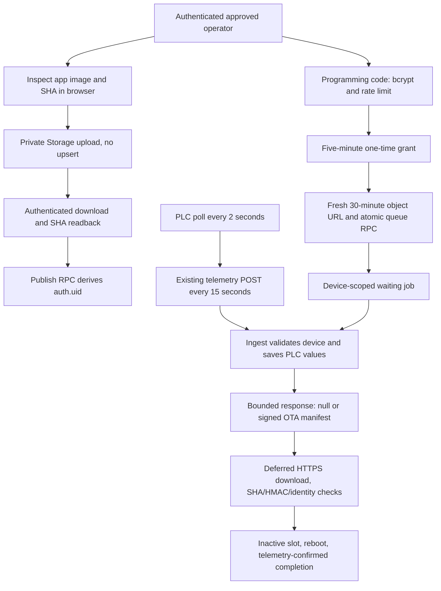
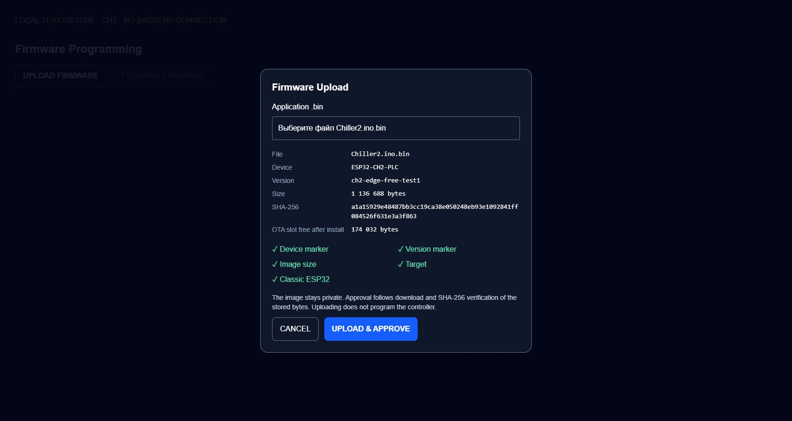
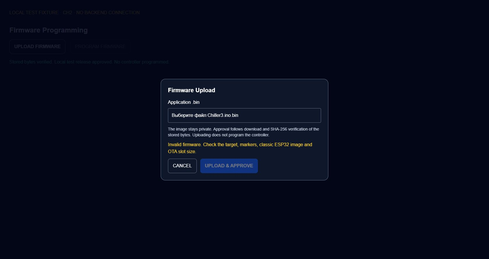

# CH2/CH3 telemetry-piggyback OTA

Prepared only. No SQL deployment, Edge deletion/deployment, release publication,
OTA queue, controller command, flash, or merge accompanies this PR. CH1 is unchanged.
This replaces PR19's embedded WSS worker; it does not establish the cause of the
earlier CH2 reboot loop or claim that the replacement passed physical testing.

## Baseline inspected

- Base: PR19 `2f37d5cab1855ae3b11a04033190d751384e9cb2`, draft/unmerged.
- Separate branch: `codex/ch23-edge-free-ota`.
- Production read-only snapshot: 2026-09-23 15:29:31.716074 UTC,
  project `eeobivvwjzakbweluwtm`.
- CH2 reported `ch2-secure-3-night1`, telemetry 15:29:30.409946 UTC.
  CH3 reported `ch3-secure-3-night1`, telemetry 15:29:26.614527 UTC.
  Zero nonterminal jobs; private firmware bucket; PR19 wake RPC present.
  The return of CH2 to its old firmware was observed, not performed by this task.
- Installed ingestion function MD5: CH2 `c1a1ea7cc88b58620d258508a60088e9`,
  CH3 `a1f9386594747d758da0a72da0d8cbe1`. The migration preserves the exact installed
  definitions by moving them into a private schema, rather than overwriting the
  production point mapping with a historical copy.
- Edge inventory still showed `chiller-ota`, eight deployments, and the separate
  `ch1-ota`, four deployments. Neither function was changed.

## Architecture

Normal discovery requires no extra connection or request. `ChillerOtaRealtime.h`,
`OtaWakeSchedule.h`, the FreeRTOS wake worker, heartbeat, debounce, reconnect and
hourly Edge fallback are removed from the new firmware. WebSockets is not a build
dependency. PLC stays at 2 seconds, telemetry at 15 seconds.

Gateway metadata includes protocol `2`, version, boot ID, job ID, phase, progress,
allowlisted failure code and reset reason. No-job responses contain only `o:null`.
An outstanding terminal acknowledgement adds `a:completed` or `a:failed` so the
device can persist it. Manifests contain only one device's job, action, device,
model, version, hash, size, expiry, bounded URL and MAC. They contain no history or
release list. The response sink caps decoded bodies at 4096 bytes and handles both
Content-Length and HTTP chunked transfer encoding.

HTTP/TLS/JSON objects from ingestion are destroyed before installation starts.
Existing NVS one-record persistence, consumed-job protection, inactive-slot writes,
SHA-256, embedded markers, CA validation, ten-minute installation deadline and
rollback-enabled bootloader requirement remain. The v2 MAC adds the exact URL to
the existing canonical manifest fields. Old Edge signatures are unchanged for old
firmware; v2 devices accept only the new URL-bound signature.

During download the ordinary telemetry loop is suspended as before. Required
transition acknowledgements and at most one progress report per 15 seconds use
`chiller_ota_report`, an authenticated Postgres RPC, with short-lived HTTPS. This
is an **active-update-only** exception to piggyback reporting. Reports cannot write
PLC telemetry receipts, cannot discover jobs, and cannot fake post-reboot telemetry.
There is no idle report caller or additional idle timer. After reboot, only actual
authenticated PLC ingestion with the target version and a different boot completes
the job. Reset reason is remotely visible through the status RPC; heap counters
remain optional, default-off, once-per-minute UART diagnostics.

## Upload and approval

`UPLOAD FIRMWARE` opens a modal. The operator selects an application `.bin`; the
browser derives device/version from unique NUL-terminated embedded markers, checks
the classic ESP32 header and application descriptor, verifies selected target and
slot size, computes SHA-256, and displays remaining slot bytes. This is header and
marker inspection, not a substitute for ESP-IDF's complete image verification.
No manually entered device/version is accepted.

The authenticated operator uploads with `upsert:false` to
`chiller-firmware/ESP32-CHx-PLC/<version>/<sha256>.bin`. It then downloads those bytes
through the authenticated Storage session and compares size and SHA. Only after
that succeeds does `chiller_firmware_publish` approve the release. A conflicting
device/version fails; an identical approved release is idempotent. A revoked release
requires administrative review. Failed or interrupted upload may leave an immutable
unapproved object; retry reads it back rather than overwriting it.

**Trust boundary:** SQL can verify Storage object identity/size, but cannot hash the
external object bytes. The approved operator's browser performs the required
readback and submits a matching verification attestation, recorded privately with
operator, object ID and time. This is not an independent server-side SHA guarantee
against a malicious approved operator. Unapproved users cannot invoke publication;
authenticated users cannot approve by raw table insert. Devices independently verify
the hash and signed manifest before activation. No permanent signed URL is created
at publication. The old service-role `--publish` CLI path is retired.

## Programming and database security

1. `chiller_firmware_unlock(device, code)` derives `auth.uid()` and checks the private
   operator allowlist, then the existing limit of five attempts per 15 minutes.
   Failed attempts return an error object instead of raising, so the counter commits.
2. The existing four-digit code is verified against a private bcrypt hash (cost
   12–16), never a frontend constant or a publicly readable table. A 32-byte random
   grant lasts five minutes; only its SHA-256 is stored.
3. The browser creates a fresh Storage signed URL for the selected release, requesting
   1800 seconds. It reads the token's actual expiry rather than trusting its clock.
4. The authenticated six-argument `chiller_ota_queue` overload derives the operator,
   validates exact configured HTTPS origin, bucket/object path and JWT URL claim,
   and requires 11–31 minutes remaining (30 minutes requested; one-minute clock
   tolerance). Storage verifies the JWT signature when the device downloads. SQL
   does not claim to verify Storage's signature. A fabricated token cannot bypass
   Storage download authentication or the image hash.
5. The queue atomically consumes the grant and creates one idempotent request ID,
   requires fresh actual telemetry and an approved release, and preserves the unique
   active-job constraint. Repeating the same operator/device/release/request ID
   returns the same job without another grant consumption or any wake.
6. The waiting-job budget is 20 minutes, capped at one minute before URL expiry.
   First authenticated discovery reduces it to the existing ten-minute install
   budget. Expiry is checked on status, telemetry or report; terminal jobs are not
   reissued. No wake is broadcast.

`chiller_firmware_status` returns device state, approved releases, ten recent jobs
and the last successful update, with no download URLs, device keys, code hash or
grant. UI performs an initial read and manual refresh; 5-second polling runs only
for active jobs and stops on terminal status or while hidden.

The migration is `supabase/ch23_edge_free_ota.sql`. All new SECURITY DEFINER entry
points lock `search_path`. `ch23_ota_private` is not an exposed API schema. It stores
the allowlist, bcrypt configuration, original OTA HMAC device keys, per-job URLs,
readback attestations, and preserved ingest implementations. No public role can
read or mutate those tables. Helper functions are revoked from public API roles.
The public report RPC validates the existing active device ingestion credential.
Ingest validates credentials outside its OTA error handler; malformed OTA metadata
cannot roll back otherwise valid PLC ingestion.

## Storage policies

The bucket remains private with a 1,310,720-byte limit. Approved authenticated
operators get INSERT and SELECT only. Paths must match the CH2/CH3 device/version/
SHA pattern. Restrictive policies deny anonymous firmware access and prevent
UPDATE/DELETE even if unrelated permissive policies exist. Non-firmware buckets
retain their existing behavior. Devices have no bucket-list permission. Signed
downloads authorize only their one object. SELECT inherently lets trusted operators
request signed URLs themselves; the application and queue enforce the bounded
programming lifetime, rather than claiming RLS can constrain Storage's `expiresIn`.

## Migration order and compatibility

**Separate approval is required to perform any rollout; nothing below was executed.**

1. Resolve/record the installed hardware baseline separately. Confirm no active jobs
   and fresh PLC telemetry. Preserve old firmware, private configs, Edge source and
   exact ingestion definitions. Keep PR19's deployed Edge and secrets unchanged.
2. Test the migration with real Supabase Storage/Auth in an isolated staging project.
   Local SQL tests do not exercise the hosted Storage HTTP/JWT implementation.
   Verify authenticated upload, readback, signing, private-object denial, bounded
   URLs and legacy firmware compatibility there before any production deployment.
3. Apply the SQL transaction once, after existing compact telemetry, base OTA,
   observability, failure diagnostics and PR19 wake migrations. Reapplication aborts
   safely rather than wrapping ingestion twice. No releases/jobs/events are deleted.
4. Privately provision `ch23_ota_private.operators` with the **existing approved**
   account UUIDs; config with the production origin and a bcrypt hash of the
   **existing** programming code; device_keys with the **existing exact** CH2/CH3
   HMAC keys. Use a privileged parameterized database connection/secret runner,
   with statement/parameter logging disabled. Do not place the clear code, keys or
   signed URLs in SQL Editor history, repository, shell arguments or reports. Do not
   change Edge secrets. Provisioning is intentionally absent from the public SQL;
   unprovisioned unlock/queue fails closed. Before rollout, the operator must supply
   this private provisioning through the approved secret workflow.
5. Verify row counts and ACLs, no telemetry regression, private bucket, and legacy
   telemetry/sync. Legacy `chiller_device_sync`, queue overload and Edge remain.
   Protocol-absent telemetry returns its original response. Old physical firmware
   still uses its existing Edge path, including for the first migration OTA.
6. Deploy the new UI only after schema/provisioning verification. Build real device
   images from private configs with unique versions and validate partitions/hash.
   The local compile-only artifacts below contain example credentials and MUST NOT
   be published or installed.
7. Later, under explicit authorization, migrate one physical controller, perform
   normal-operation and outage/OTA/rollback tests, then the other. New devices need
   the new UI's queue (which stores the bounded URL); an old Edge-only queue does
   not provision a v2 download. Do not silently fall back to Edge on v2 devices.
8. Delete legacy Edge and wake-only DB objects only in a later explicitly approved
   cleanup after both devices are stable and no rollback compatibility is needed.

## Rollback

Before physical migration, reverting the UI leaves old firmware/Edge fully usable;
leave the additive database migration in place. If new firmware needs reverting,
use the new authenticated programming flow to deliver the exact preserved known-good
device image while it remains reachable, or the already-established local recovery
path. Do not claim OTA recovery works when the device cannot connect. Never create
repeated jobs while a job is nonterminal.

Keep the v2 ingest wrappers and queue until no v2 firmware remains. Rolling back
the wrappers first would remove v2 discovery and acknowledgements. Only after that
condition is verified, a reviewed transaction may remove the public wrappers and
move the preserved private `ingest_ch2(jsonb)`/`ingest_ch3(jsonb)` functions back to
`public`, restoring their captured original grants. Do not drop the private schema,
release/job history or Storage objects as a routine rollback.

## Traffic and egress

Per continuously awake device: 86,400 / 15 = **5,760 existing telemetry POSTs/day**;
two devices = **11,520/day**. The 07:00–22:00 schedule, if retained by a deployed
firmware variant, scales these values to 3,600 and 7,200. This PR does not introduce
or change a sleep schedule.

- New firmware OTA Edge invocations: **0** (including active OTA).
- Additional idle OTA-only requests: **0**.
- Permanent embedded Realtime connections: **0**.
- Compact no-job JSON is 10 bytes minified / 11 bytes in PostgreSQL JSONB text.
  Budgeting 11 bytes gives **63,360 bytes/device/day**, **126,720 bytes/day for two**
  (about 0.121 MiB), excluding HTTP headers/TLS. A persisted completed ACK is
  26 bytes minified / 29 JSONB-text bytes: at most 167,040 bytes/device/day.
- The previous function result was `ok`, asset_code and device_code (70 JSONB-text
  bytes). This implementation replaces that result, so payload bytes can decrease
  even though firmware now consumes the response. `Prefer:return=minimal` is not
  treated as proof that hosted RPC responses were zero bytes; validate real staging
  wire bytes and billing separately.
- Old 15-second Edge sync adds another 5,760 calls/device/day, plus its response,
  headers and TLS overhead. These are eliminated for migrated devices.
- PR19's intended WSS model had hourly Edge fallback plus persistent join/heartbeat/
  reconnect traffic. The failed physical window observed at least 127 successful
  syncs in 30m10s amid boot churn. No lossless WSS byte capture exists, so a numeric
  WSS-egress saving is **not measured**. The new design eliminates that connection.
- Firmware upload/readback costs one image upload and one image-size authenticated
  download per verification. A real OTA downloads the image once. These are
  occasional operations, not idle traffic. UI status responses are separate and
  idle polling is absent.

## Validation evidence

Final results: **85/85 tests pass**, Vite production build passes, changed UI files
pass ESLint. The final image/partition validator passes for both devices with the
required 64 KiB minimum margin. These are default-off diagnostic-mode builds with
example credentials and unique compile-test versions, not physical-test releases.

| Resource (bytes) | CH2 | CH3 |
|---|---:|---:|
| Preserved PR19 WSS image, diagnostics off | 1,228,256 | 1,228,240 |
| Final telemetry-piggyback app `.bin` | 1,136,688 | 1,136,688 |
| Flash recovered | 91,568 | 91,552 |
| Remaining 1,310,720-byte OTA slot | 174,032 | 174,032 |
| Static RAM before / after | 49,456 / 49,344 | 49,456 / 49,344 |

The earlier real `ch2-pr19-diag1` image was 1,230,192 bytes with diagnostics enabled;
it is a separate reference, not a like-for-like configuration comparison. Unique
version/configuration strings also affect exact binary size. Dynamic WSS/TLS/worker
heap savings remain unmeasured; a 112-byte static-RAM reduction is not a runtime
heap measurement. The board's generic 8 MB compiler maximum is not the OTA slot:
the post-link validator checks the actual default partition binary and 64 KiB margin.

See `ch23-edge-free-build-results.json` for final compile-only image/hash/partition,
flash/headroom and static-RAM comparison. Hardware runtime remains **NOT TESTED**.
Automated tests execute the SQL migration with pgcrypto, storage RLS and simulated
Auth roles, plus real frontend byte validation and the existing firmware security,
deferred-execution, failure and rollback regressions. Legacy Edge tests remain for
migration compatibility; tests specific to the deleted WSS worker are superseded.
The local visual fixture uses an in-memory Storage/RPC adapter and cannot create a
production object or job.

Desktop browser verification: the compiled CH2 app's embedded identity/version,
size/hash and headroom appeared correctly; local readback/approval completed; the
compiled CH3 app was rejected in the CH2 modal with approval disabled.

## Changed implementation files

| Area | Files |
|---|---|
| Database | `supabase/ch23_edge_free_ota.sql` |
| UI | `client/src/components/ChillerProgramming.jsx`, `FirmwareUpload.jsx`, `client/src/hooks/useOtaStatus.js`, `client/src/utils/chillerFirmware.js` |
| Firmware | `firmware/Chiller2/Chiller2.ino`, `firmware/Chiller3/Chiller3.ino`, each `ota_config.example.h`, `firmware/common/ChillerOta.h`, `ChillerRuntimeDiagnostics.h` |
| Removed firmware | `firmware/common/ChillerOtaRealtime.h`, `OtaWakeSchedule.h` |
| Offline release tool | `firmware/prepare-chiller-release.mjs` (validation retained; direct publication retired) |
| Legacy designation | `supabase/functions/chiller-ota/README.md` (function implementation unchanged) |
| New tests | `client/tests/ch23-edge-free-db.test.mjs`, `ch23-edge-free-upload.test.mjs`, `fixtures/firmware-upload.html`, `fixtures/firmware-upload.jsx` |
| Adapted regressions | `client/tests/chiller-deferred-ota.test.mjs`, `chiller-device-diagnostics.test.mjs`, `chiller-ota.test.mjs`, `chiller-post-isolation.test.mjs`, `chiller-runtime-diagnostics.test.mjs`, `ota-wake.test.mjs` |
| Evidence | This document, `ch23-edge-free-build-results.json`, `images/ch23-firmware-*.png` |

Sources: [Supabase Storage RLS](https://supabase.com/docs/guides/storage/security/access-control),
[signed URLs](https://supabase.com/docs/reference/javascript/file-buckets-createsignedurl),
[PostgreSQL pgcrypto](https://www.postgresql.org/docs/17/pgcrypto.html).
